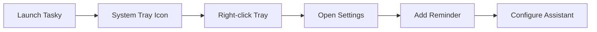

<div align="center">


# 🎯 Tasky Your Desktop Reminder Companion 

[](https://github.com/your-repo/tasky)
[](LICENSE)
[](https://electronjs.org/)
[](https://reactjs.org/)

**An electron desktop application with an animated assistant companion. Tasky helps you stay organized with customizable recurring reminders, notification sounds, and a friendly desktop companion that delivers your reminders with personality.**

[📥 Download](https://github.com/your-repo/tasky/releases) • [🚀 Quick Start](#installation-) • [📖 Documentation](#usage-) • [🛠️ Development](#development-️)

</div>

---

## ✨ Features

<table>
<tr>
<td width="33%">

### 🔔 Core Functionality
- **Recurring Reminders**: Set up reminders for specific days of the week and times
- **System Tray Integration**: Runs quietly in your system tray
- **Platform**: Works on Windows
- **Notification Sounds**: Customizable audio alerts for reminders
- **Auto-Start**: Optional automatic startup with your system

</td>
<td width="33%">

### 🤖 Desktop Assistant
- **Animated Companion**: Choose from multiple avatar characters
- **Custom Avatars**: Use your own images as assistant avatars
- **Interactive Speech Bubbles**: Reminders delivered with personality
- **Positioning Options**: Place assistant above or below other windows
- **Draggable Interface**: Move your assistant anywhere on screen

</td>
<td width="33%">

### 🎨 Customization
- **Multiple Themes**: Light and dark mode support
- **Notification Appearance**: Customize notification colours, fonts, and text colours
- **Flexible Settings**: Configure notifications, sounds, and assistant behaviour
- **Bubble Positioning**: Choose left or right side speech bubbles
- **Animation Controls**: Enable or disable assistant animations
- **Font Selection**: Choose from 9 different fonts for notifications with live preview

</td>
</tr>
</table>

## 🚀 Installation

<details>
<summary><strong>📥 Download Pre-built Binary</strong></summary>

1. Visit the [Releases](https://github.com/your-repo/tasky/releases) page
2. Download the latest version for your operating system:
<<<<<<< HEAD
   - **Windows**: `Tasky-Setup-1.0.0.exe`
   - **macOS**: `Tasky-1.0.0.dmg`
   - **Linux**: `Tasky-1.0.0.AppImage`

</details>

<details>
<summary><strong>🔨 Build from Source</strong></summary>
=======
   - Windows: `Tasky-Setup-1.0.0.exe`
>>>>>>> f82aa0fdd658e1b70c193576a7243208b5415c93

```bash
# Clone the repository
git clone https://github.com/your-repo/tasky.git
cd tasky

# Install dependencies
npm install

# Run in development mode
npm run dev

# Build for production
npm run build

# Create distributable packages
npm run dist
```

</details>

> **💡 Quick Tip**: After installation, Tasky will appear in your system tray. Right-click the tray icon to get started!

## 📖 Usage

### 🚀 Getting Started
<div align="center">



</div>

1. **Launch Tasky** - it will appear in your system tray
2. **Right-click** the tray icon and select "📋 Open Settings"
3. **Create your first reminder** by clicking "Add Reminder"
4. **Configure your desktop assistant** in the Assistant tab

---

### ⏰ Creating Reminders

<table>
<tr>
<td width="50%">

**Step-by-Step Guide:**
1. Click **"Add Reminder"** in the main interface
2. Enter your **reminder message**
3. Set the **time** (supports both 12-hour and 24-hour formats)
4. Select which **days of the week** to repeat
5. **Enable the reminder** with the toggle switch

</td>
<td width="50%">

```json
{
  "message": "Take a break!",
  "time": "14:30",
  "days": ["Monday", "Wednesday", "Friday"],
  "enabled": true
}
```

</td>
</tr>
</table>

---

### 🤖 Customizing Your Assistant

> **Choose from 8 built-in avatars**: Clippy, Merlin, Rover, Genie, Rocky, Bonzi, Peedy, Links

1. Go to the **"Assistant"** tab in settings
2. Choose from built-in avatars: Clippy, Merlin, Rover, Genie, Rocky, Bonzi, Peedy, Links
3. Or **upload your custom avatar** image
4. Adjust **positioning, animation, and speech bubble** settings
5. Toggle **dragging mode** to move your assistant around the desktop

---

### 🎨 Customizing Notifications

1. Go to the **"Settings"** tab
2. Under **"Notifications & Alerts"**:
   - **Notification Colour**: Choose background colour for popup bubbles
   - **Notification Font**: Select from 9 fonts with live preview
   - **Notification Text Color**: Set text color for optimal readability
3. **Test your changes** with the "Test Notification" button

---

### 🖱️ System Tray Features

| Action | Function |
|--------|----------|
| **Left-click/Double-click** | Open settings window |
| **Right-click** | Access context menu with quick toggles |
| **Notifications Toggle** | Quickly enable/disable all reminders |
| **Exit** | Properly close the application |

## ⚙️ Configuration

<details>
<summary><strong>📁 Configuration File Locations</strong></summary>

Tasky stores its configuration in the following locations:

| Platform | Location |
|----------|----------|
| **Windows** | `%APPDATA%/tasky/tasky-config-v2.json` |
| **macOS** | `~/Library/Application Support/tasky/tasky-config-v2.json` |
| **Linux** | `~/.config/tasky/tasky-config-v2.json` |

</details>

### 🔧 Key Settings

```json
{
  "enableNotifications": true,
  "enableSound": true,
  "enableAssistant": true,
  "autoStart": false,
  "selectedAvatar": "Clippy",
  "enableAnimation": true,
  "assistantLayer": "above",
  "bubbleSide": "left",
  "enableDragging": true,
  "notificationColor": "#7f7f7c",
  "notificationFont": "system",
  "notificationTextColor": "#ffffff"
}
```

<table>
<tr>
<td width="50%">

**🔔 Notification Settings**
- `enableNotifications`: Master toggle
- `enableSound`: Audio alerts
- `notificationColor`: Background color
- `notificationFont`: Font family
- `notificationTextColor`: Text color

</td>
<td width="50%">

**🤖 Assistant Settings**
- `enableAssistant`: Show desktop companion
- `selectedAvatar`: Character choice
- `enableAnimation`: Movement effects
- `assistantLayer`: Window positioning
- `bubbleSide`: Speech bubble position
- `enableDragging`: Allow repositioning

</td>
</tr>
</table>

## 🛠️ Development

<details>
<summary><strong>📁 Project Structure</strong></summary>

```
tasky/
├── src/
│   ├── main.js              # Main Electron process
│   ├── preload.js           # Preload script for security
│   ├── electron/            # Electron backend modules
│   │   ├── scheduler.js     # Reminder scheduling logic
│   │   ├── storage.js       # Data persistence
│   │   ├── assistant.js     # Desktop companion
│   │   └── assistant-script.js # Assistant frontend logic
│   ├── renderer/            # React frontend
│   │   ├── App.jsx          # Main React component
│   │   └── dist/            # Built frontend assets
│   ├── components/          # React components
│   └── assets/              # Images, sounds, icons
├── package.json
└── README.md
```

</details>

### 🔧 Technologies Used

<div align="center">


</div>

| Technology | Purpose |
|------------|---------|
| **Electron** | Desktop application framework |
| **React** | Frontend user interface |
| **Vite** | Build tool and development server |
| **Tailwind CSS** | Styling framework |
| **node-cron** | Reminder scheduling |
| **electron-store** | Data persistence |

### 📜 Available Scripts

```bash
npm run dev          # Start development server
npm run build        # Build renderer and electron
npm run build-renderer # Build React frontend only
npm run build-electron # Build Electron backend only
npm run dist         # Create distributable packages
npm run pack         # Package without creating installer
```

### 📦 Building for Distribution

The application uses `electron-builder` for creating distributable packages:

```bash
# Build and package for the current platform
npm run dist

# The output will be in the dist/ directory:
# - Windows: .exe installer and unpacked folder
```

> **🎯 Pro Tip**: Use `npm run pack` for faster testing without creating installers

---

## 📄 Disclaimer

<details>
<summary><strong>⚠️ Clippy Character Notice</strong></summary>

**Clippy Character Notice**: This project includes a "Clippy" character option as part of its desktop assistant feature. This is a fan art/tribute project created for educational and personal use purposes. The Clippy character and any associated trademarks are the property of Microsoft Corporation. This project is not affiliated with, endorsed by, or sponsored by Microsoft Corporation.

The Clippy assistant implementation in this project is:
- A creative interpretation and homage to the original Microsoft Office Assistant
- Developed independently for learning and demonstration purposes
- Not intended for commercial use or distribution
- Part of a broader desktop assistant system with multiple character options

If you represent Microsoft Corporation and have concerns about this implementation, please contact the project maintainer.

</details>

---

<div align="center">

### 💝 Made with ❤️ by **Traves Theberge**

**Stay organized, stay productive!** 🚀

[](https://github.com/your-username)
[](https://twitter.com/your-handle)

---

*If you find Tasky helpful, consider giving it a ⭐ on GitHub!*

</div>
