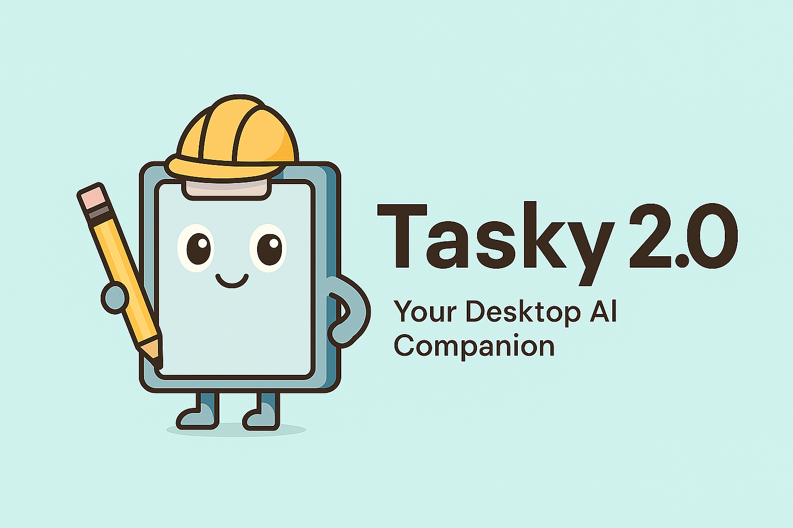

<p align="center">
  
</p>

### Tasky 2.0 – Desktop Task Management (Electron + React)

Tasky 2.0 is a cross‑platform desktop task manager with a lightweight UI, a desktop companion, reminders, analytics, and optional MCP integration so external LLM tools can create and manage tasks. Storage is a single SQLite database shared by the app and the MCP agent.

## Features

- **Tasks**: title, description, due date, tags, dependencies, affected files, execution path
- **Reminders**: desktop bubble notifications, sound, 15‑minute pre‑due alerts
- **Assistant**: on‑desktop companion with configurable avatar, position, style
- **AI execution**: run tasks via external agents (Claude or Gemini CLIs) in a terminal
- **MCP**: Model Context Protocol agent for CRUD + execution from compatible clients
- **Import/Export**: JSON/CSV/YAML/XML import; JSON export; basic analytics

## Quick start

Prerequisites:

- Node.js 18+
- Windows/macOS/Linux. For AI execution, install CLI(s): `claude` and/or `gemini` on PATH

Clone, install, run (development):

```bash
npm install
npm run dev
```

Production‑like run (build then start Electron):

```bash
# Uses TASKY_DB_PATH=./data/tasky.db by default
npm start
```

Build distributables:

```bash
npm run dist      # all platforms
npm run dist:win  # or dist:mac, dist:linux
```

## Configuration

- `TASKY_DB_PATH` (default `./data/tasky.db`): location of the SQLite database
- `TASKY_SQLITE_JOURNAL` (`DELETE`|`WAL`, default `DELETE`): SQLite journal mode
- `NODE_ENV` (`development`|`production`): enables DevTools in development

Both the Electron app and the MCP agent must reference the same `TASKY_DB_PATH`.

## Architecture

- `src/renderer` – React UI (settings, reminders, tasks UI)
- `src/electron` – main process: tray + window, assistant, scheduler, task manager, HTTP bridge
- `src/core/task-manager` – `TaskyEngine` (CRUD, analytics, OODA helpers)
- `src/core/storage` – SQLite persistence via `better-sqlite3`
- `tasky-mcp-agent` – MCP server exposing Tasky tools over stdio

The main process also runs a lightweight HTTP server on `http://localhost:7844` for MCP integration:

- `POST /execute-task` → executes a task via an external agent terminal
- `POST /notify-task-created` → shows a creation bubble
- `POST /notify-reminder-created` → shows a creation bubble

## Data model

Dates are real `Date` instances in‑app; they are persisted as ISO strings.

```text
TaskyTask.schema
- id: string
- title: string
- description?: string
- dueDate?: Date
- createdAt: Date
- updatedAt?: Date
- tags?: string[]
- affectedFiles?: string[]
- estimatedDuration?: number
- dependencies?: string[]
- assignedAgent?: 'gemini' | 'claude'
- executionPath?: string

TaskyTask (top‑level)
- status: 'PENDING' | 'IN_PROGRESS' | 'COMPLETED' | 'NEEDS_REVIEW' | 'ARCHIVED'
- humanApproved: boolean
- result?: string
- completedAt?: Date
- reminderEnabled?: boolean
- reminderTime?: string
- metadata?: { version: number; createdBy: string; lastModified: Date; archivedAt?: Date }
```

## Creating tasks

- UI: use the Task form in the app
- IPC: `window.electronAPI.invoke('task:create', createTaskInput)`
- Import: `window.electronAPI.invoke('task:import', { filePath | tasks })` supporting JSON/CSV/YAML/XML
- MCP: see “MCP integration” below

## Executing tasks (AI agents)

```ts
window.electronAPI.invoke('task:execute', taskId, { agent: 'claude' | 'gemini' })
```

What happens:

- Builds a structured prompt from the task details
- Resolves the working directory to `schema.executionPath` (relative to project root if needed)
- Opens a terminal and pipes the prompt to the selected CLI
  - Windows prefers WSL if available, otherwise PowerShell
  - macOS/Linux use Terminal/Bash
- Creates a sentinel file `.tasky/status/done-<id>` on success to auto‑complete the task

## MCP integration

Install and build the agent:

```bash
npm run agent:build
```

Example MCP client config (Cursor `mcp-config.json`):

```json
{
  "mcpServers": {
    "tasky-command": {
      "type": "command",
      "command": "node",
      "args": ["tasky-mcp-agent/dist/mcp-server.js"],
      "cwd": ".",
      "env": {
        "TASKY_DB_PATH": "data/tasky.db"
      },
      "disabled": false
    }
  }
}
```

Notes:

- The Tasky app must be running for full execution via `POST /execute-task`. If it’s not, the MCP agent falls back to status updates only.
- Ensure the MCP agent and the app share the same `TASKY_DB_PATH`.

