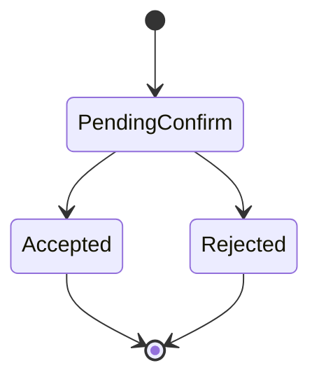
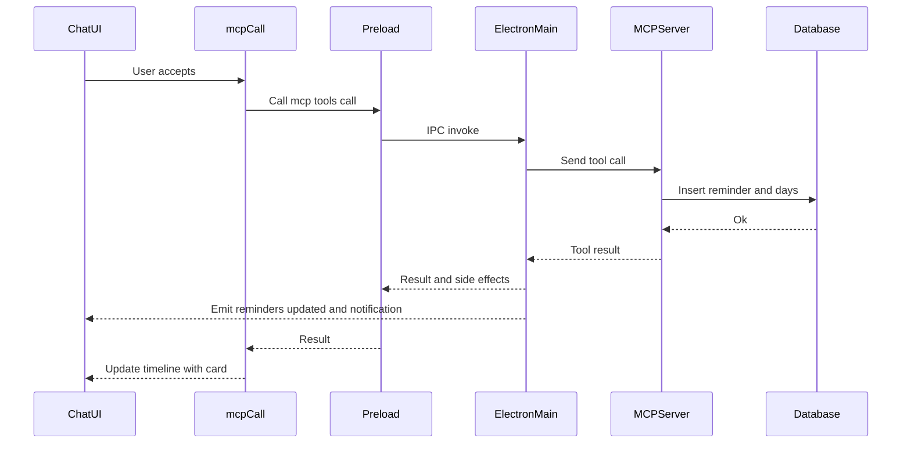
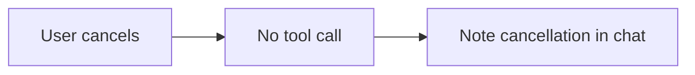

# tasky_create_reminder

## Description
Creates a new Tasky reminder with message, time, recurring days, and scheduling options.

## Purpose
Set up recurring or one-time notifications to remind users about tasks, deadlines, or important events. Supports flexible time parsing including relative times.

## Parameters

| Parameter | Type | Required | Description |
|-----------|------|----------|-------------|
| `message` | string | ✅ | Reminder message text |
| `time` | string | ✅ | Time in HH:MM format or relative ("in 5 minutes", "in 2 hours") |
| `days` | string[] | ✅ | Array of weekdays: ["monday", "tuesday", "wednesday", "thursday", "friday", "saturday", "sunday"] |
| `enabled` | boolean | ❌ | Whether reminder is active (default: true) |
| `oneTime` | boolean | ❌ | One-time reminder vs. recurring (default: false, auto-true for relative times) |

## UI Flow

1. **User Input:** "Remind me to check emails at 9 AM on weekdays"
2. **AI Processing:** Parses natural language into structured parameters:
   - Message: "check emails"  
   - Time: "09:00"
   - Days: ["monday", "tuesday", "wednesday", "thursday", "friday"]
3. **Tool Call:** `mcpCall` invoked with parsed reminder data
4. **Confirmation:** User sees confirmation overlay with:
   - Parsed schedule visualization
   - Reminder frequency (daily/weekly/one-time)
   - Next occurrence calculation
5. **Execution:** Upon approval, reminder created in database
6. **Result Display:** Success card shows created reminder details

## Time Processing Logic

## Confirmation Outcomes

This tool requires user confirmation. Auto accept is not used for creation.

State



Accepted



Rejected



Auto accept

- Not applicable for create

Side effects on accept
- Emits `tasky:reminders-updated` event
- OS notification for created reminder
- Adaptive card snapshot embedded in chat

See also: [State Management Diagrams](../state-management-diagrams.md)

## Adaptive Card Response

Snapshot shape

```json
{
  "__taskyCard": {
    "kind": "result",
    "tool": "tasky_create_reminder",
    "status": "success",
    "data": {
      "id": "abc123",
      "message": "Check emails",
      "time": "09:00",
      "days": ["monday","tuesday","wednesday","thursday","friday"],
      "enabled": true,
      "oneTime": false
    },
    "meta": {
      "operation": "create",
      "timestamp": "2025-09-17T16:00:00.000Z"
    }
  }
}
```

Error variant

```json
{
  "__taskyCard": {
    "kind": "result",
    "tool": "tasky_create_reminder",
    "status": "error",
    "error": { "message": "Validation failed", "code": "VALIDATION" }
  }
}
```

Renderer notes
- Success: Render created reminder card with schedule chips.
- Error: Inline error card with validation hints.

### Standard Time Format
- **Input:** "09:00", "14:30", "23:59"
- **Processing:** Direct HH:MM validation
- **Result:** Recurring reminder at specified time

### Relative Time Format  
- **Input:** "in 5 minutes", "in 2 hours", "in 30 minutes"
- **Processing:** Parsed by smart time parser utility
- **Result:** One-time reminder calculated from current time

```typescript
// Smart time parsing for relative times
if (args.time.toLowerCase().includes('in ') || args.time.toLowerCase().includes('from now')) {
  const { parseRelativeTime } = await import('./utils/time-parser.js');
  const parsed = parseRelativeTime(args.time);
  finalTime = parsed.time;
  isOneTime = true; // Relative times are automatically one-time
}
```

## Database Operations

```sql
-- Main reminder insertion (handled by ReminderBridge)
INSERT INTO reminders (
  id, message, time, enabled, one_time, created_at, updated_at, metadata
) VALUES (
  @id, @message, @time, @enabled, @one_time, @created_at, @updated_at, @metadata
);

-- Days insertion for recurring reminders
INSERT INTO reminder_days (reminder_id, day) VALUES (?, ?);
```

## MCP Request Examples

### Recurring Weekday Reminder
```bash
curl -X POST http://localhost:7844/mcp \
  -H "Content-Type: application/json" \
  -d '{
    "jsonrpc": "2.0",
    "id": 6,
    "method": "tools/call",
    "params": {
      "name": "tasky_create_reminder",
      "arguments": {
        "message": "Check emails and respond to urgent items",
        "time": "09:00",
        "days": ["monday", "tuesday", "wednesday", "thursday", "friday"],
        "enabled": true
      }
    }
  }'
```

### One-Time Relative Reminder
```bash
curl -X POST http://localhost:7844/mcp \
  -H "Content-Type: application/json" \
  -d '{
    "jsonrpc": "2.0",
    "id": 7,
    "method": "tools/call",
    "params": {
      "name": "tasky_create_reminder",
      "arguments": {
        "message": "Take a break",
        "time": "in 25 minutes",
        "days": [],
        "oneTime": true
      }
    }
  }'
```

### Weekend Reminder
```bash
curl -X POST http://localhost:7844/mcp \
  -H "Content-Type: application/json" \
  -d '{
    "jsonrpc": "2.0",
    "id": 8,
    "method": "tools/call",
    "params": {
      "name": "tasky_create_reminder",
      "arguments": {
        "message": "Plan next week activities",
        "time": "10:00",
        "days": ["saturday", "sunday"],
        "enabled": true
      }
    }
  }'
```

## Response Format

```json
{
  "jsonrpc": "2.0",
  "id": 6,
  "result": {
    "content": [
      {
        "type": "text",
        "text": "Reminder created successfully"
      },
      {
        "type": "text",
        "text": "{\"id\":\"reminder_20250907_164500_abc123\",\"message\":\"Check emails and respond to urgent items\",\"time\":\"09:00\",\"days\":[\"monday\",\"tuesday\",\"wednesday\",\"thursday\",\"friday\"],\"enabled\":true,\"oneTime\":false,\"createdAt\":\"2025-09-07T16:45:00.000Z\",\"nextOccurrence\":\"2025-09-08T09:00:00.000Z\"}"
      }
    ]
  }
}
```

## UI Components

- **ConfirmOverlay:** Shows reminder creation confirmation with:
  - Message preview
  - Schedule visualization (daily/weekly pattern)
  - Next occurrence time
  - Frequency description
- **ToolCallDisplay:** Renders creation operation status
- **AdaptiveCardRenderer:** Displays created reminder card with:
  - Message text
  - Schedule badges (weekday chips)
  - Time display
  - Enabled/disabled status
  - One-time vs. recurring indicator

## Schedule Visualization Examples

### Weekday Schedule
```
📅 Weekdays at 9:00 AM
Mon Tue Wed Thu Fri
Next: Tomorrow at 9:00 AM
```

### Weekend Schedule  
```
📅 Weekends at 10:00 AM
Sat Sun
Next: Saturday at 10:00 AM
```

### One-Time Schedule
```
⏰ One-time reminder
In 25 minutes (3:10 PM today)
```

## Natural Language Processing

### Common Patterns
- **Daily:** "every day at 8 AM" → All days
- **Weekdays:** "on weekdays at 9 AM" → Monday-Friday  
- **Weekends:** "weekend mornings at 10 AM" → Saturday-Sunday
- **Specific Days:** "Monday and Wednesday at 2 PM" → ["monday", "wednesday"]
- **Relative:** "in 30 minutes" → One-time, calculated time

### Time Formats Supported
- **24-hour:** "14:30", "09:00", "23:59"
- **12-hour:** "2:30 PM", "9:00 AM", "11:59 PM" (parsed by AI)
- **Relative:** "in X minutes", "in X hours"
- **Natural:** "at noon", "at midnight" (parsed by AI)

## Validation Rules

| Field | Validation |
|-------|------------|
| `message` | Required, non-empty string |
| `time` | Must be HH:MM format or valid relative time |
| `days` | Array of valid weekday strings |
| `enabled` | Boolean, defaults to true |
| `oneTime` | Boolean, auto-set for relative times |

## Error Handling

| Error | Cause | Response |
|-------|--------|----------|
| Missing message | `message` parameter not provided | `{"content": [{"type": "text", "text": "message is required"}], "isError": true}` |
| Invalid time format | Malformed time string | Time parsing error with details |
| Invalid days | Unknown weekday names | Validation error for day values |
| Empty days array | No days specified for recurring reminder | Warning but allows creation |

## Time Parser Integration

The system uses a smart time parser (`utils/time-parser.ts`) that handles:

### Relative Time Parsing
- **Minutes:** "in 5 minutes", "in 30 minutes"
- **Hours:** "in 2 hours", "in 1 hour"  
- **Mixed:** "in 1 hour 30 minutes"

### Calculation Logic
```typescript
const parseRelativeTime = (input: string) => {
  const now = new Date();
  const minutes = extractMinutes(input);
  const hours = extractHours(input);
  
  const targetTime = new Date(now.getTime() + (hours * 60 + minutes) * 60000);
  
  return {
    time: targetTime.toTimeString().slice(0, 5), // HH:MM
    date: targetTime.toISOString().slice(0, 10)   // YYYY-MM-DD
  };
};
```

## Performance Considerations

- **Time Calculation:** Relative times calculated once at creation
- **Next Occurrence:** Computed for UI display
- **Schedule Validation:** Days validated against enum values
- **Database Efficiency:** Separate table for days to normalize data

## Integration with Notification System

Created reminders integrate with the main Tasky application's notification system:
- **Electron Notifications:** Native system notifications
- **Schedule Management:** Background service checks for due reminders
- **Snooze Support:** Can be extended with snooze functionality
- **History Tracking:** Reminder execution history maintained

## Related Components

- `tasky-mcp-agent/src/mcp-server.ts:197-242` - Tool definition and handler
- `tasky-mcp-agent/src/utils/reminder-bridge.ts` - Database operations
- `tasky-mcp-agent/src/utils/time-parser.ts` - Smart time parsing
- `src/components/chat/ConfirmOverlay.tsx` - Reminder creation confirmation
- `src/components/chat/AdaptiveCardRenderer.tsx` - Reminder card display

## Best Practices

1. **Clear Messages:** Use descriptive reminder messages
2. **Appropriate Frequency:** Choose recurring vs. one-time based on need
3. **Reasonable Times:** Set reminders at actionable times
4. **Day Selection:** Be specific about which days need reminders
5. **Enable Management:** Use enabled flag for temporary disabling