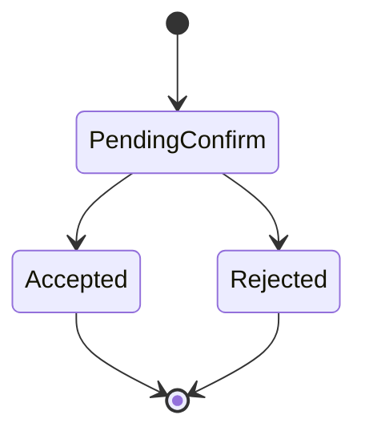
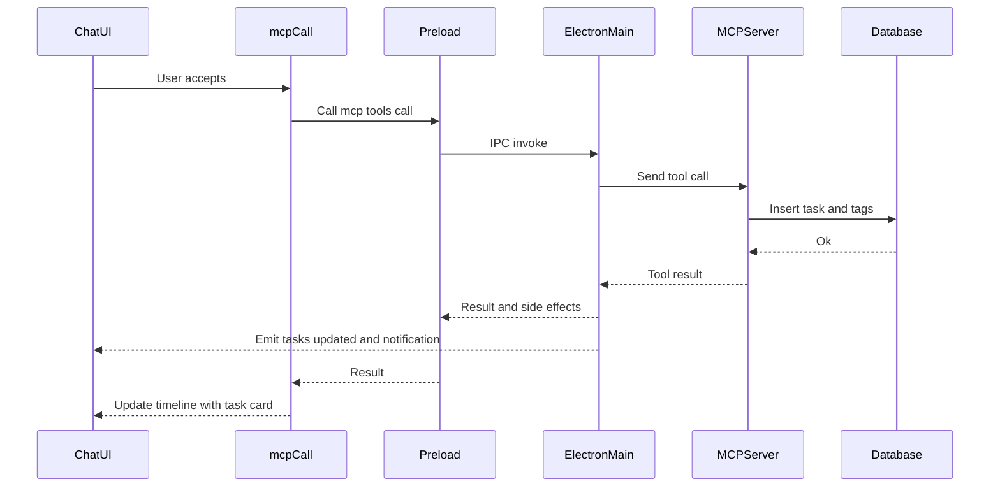

# tasky_create_task

## Description
Creates a new Tasky task with title, description, due date, tags, and other properties.

## Purpose
Add new tasks to the system with full metadata support including tags, due dates, assigned agents, and execution paths.

## Parameters

| Parameter | Type | Required | Description |
|-----------|------|----------|-------------|
| `title` | string | ✅ | Task title |
| `description` | string | ❌ | Task description |
| `dueDate` | string | ❌ | Due date in ISO format (e.g., "2025-12-31T23:59:59Z") |
| `tags` | string[] | ❌ | Array of tag strings |
| `affectedFiles` | string[] | ❌ | Array of file paths related to the task |
| `estimatedDuration` | number | ❌ | Estimated duration in minutes |
| `dependencies` | string[] | ❌ | Array of dependency task IDs |
| `reminderEnabled` | boolean | ❌ | Enable reminder for this task |
| `reminderTime` | string | ❌ | Reminder time in HH:MM format |
| `assignedAgent` | "claude" \| "gemini" | ❌ | Assigned AI agent |
| `executionPath` | string | ❌ | Path for task execution |
| `random_string` | string | ❌ | Legacy support - used as title if title missing |

## UI Flow

1. **User Input:** "Create a task to fix the login bug due tomorrow"
2. **AI Processing:** Parses natural language into structured parameters
3. **Tool Call:** `mcpCall` invoked with extracted parameters
4. **Confirmation:** User sees confirmation overlay with tool details
5. **Execution:** Upon approval, task created in database
6. **Result Display:** Success card shows created task details with ID
7. **Chat History:** Result persisted as adaptive card in conversation

## Database Operations

## Confirmation Outcomes

This tool requires user confirmation. Auto accept is not used for creation.

State



Accepted



Rejected


Auto accept

- Not applicable for create

Side effects on accept
- Emits `tasky:tasks-updated` event
- OS notification for created task
- Adaptive card snapshot embedded in chat

See also: [State Management Diagrams](../state-management-diagrams.md)

## Adaptive Card Response

Snapshot shape

```json
{
  "__taskyCard": {
    "kind": "result",
    "tool": "tasky_create_task",
    "status": "success",
    "data": {
      "schema": {
        "id": "fix_login_bug_20250907_143022_abc123",
        "title": "Fix login bug",
        "description": "Users cannot log in with Google OAuth",
        "dueDate": "2025-09-08T17:00:00.000Z",
        "tags": ["bug","authentication","urgent"],
        "assignedAgent": "claude",
        "estimatedDuration": 120
      },
      "status": "PENDING",
      "reminderEnabled": false
    },
    "meta": { "operation": "create", "timestamp": "2025-09-17T16:00:00.000Z" }
  }
}
```

Error variant

```json
{
  "__taskyCard": {
    "kind": "result",
    "tool": "tasky_create_task",
    "status": "error",
    "error": { "message": "title is required", "code": "VALIDATION" }
  }
}
```

Renderer notes
- Success: Task card with badges and tags.
- Error: Inline error with missing fields.

```sql
-- Main task insertion
INSERT INTO tasks (
  id, title, description, status, created_at, updated_at, 
  due_date, reminder_enabled, result, 
  completed_at, assigned_agent, execution_path, metadata
) VALUES (
  @id, @title, @description, 'PENDING', @created_at, @updated_at,
  @due_date, 0, @reminder_enabled, NULL, 
  NULL, @assigned_agent, @execution_path, @metadata
);

-- Tag insertion (if tags provided)
INSERT INTO task_tags (task_id, tag) VALUES (?, ?);
```

## MCP Request Example

```bash
curl -X POST http://localhost:7844/mcp \
  -H "Content-Type: application/json" \
  -d '{
    "jsonrpc": "2.0",
    "id": 1,
    "method": "tools/call",
    "params": {
      "name": "tasky_create_task",
      "arguments": {
        "title": "Fix login bug",
        "description": "Users cannot log in with Google OAuth",
        "dueDate": "2025-09-08T17:00:00Z",
        "tags": ["bug", "authentication", "urgent"],
        "assignedAgent": "claude",
        "estimatedDuration": 120
      }
    }
  }'
```

## Response Format

```json
{
  "jsonrpc": "2.0",
  "id": 1,
  "result": {
    "content": [
      {
        "type": "text",
        "text": "Task fix_login_bug_20250907_143022_abc123: Fix login bug"
      },
      {
        "type": "text", 
        "text": "{\"schema\":{\"id\":\"fix_login_bug_20250907_143022_abc123\",\"title\":\"Fix login bug\",\"description\":\"Users cannot log in with Google OAuth\",\"createdAt\":\"2025-09-07T14:30:22.000Z\",\"updatedAt\":\"2025-09-07T14:30:22.000Z\",\"dueDate\":\"2025-09-08T17:00:00.000Z\",\"tags\":[\"bug\",\"authentication\",\"urgent\"],\"assignedAgent\":\"claude\",\"estimatedDuration\":120},\"status\":\"PENDING\",\"reminderEnabled\":false}"
      }
    ]
  }
}
```

## UI Components

- **ConfirmOverlay:** Shows confirmation dialog with tool parameters
- **ToolCallDisplay:** Renders tool execution status
- **AdaptiveCardRenderer:** Displays structured task result
- **MessageContainer:** Integrates result into chat timeline

## Error Handling

| Error | Cause | Response |
|-------|--------|----------|
| Missing title | `title` parameter not provided | `{"content": [{"type": "text", "text": "title is required"}], "isError": true}` |
| Database error | SQLite operation failure | Error message with database details |
| Invalid date | Malformed `dueDate` | Error during date parsing |

## Implementation Details

- **Task ID Generation:** `{title_prefix}_{YYYYMMDD_HHMMSS}_{uuid8}`
- **Default Status:** All new tasks start with `PENDING` status
- **Notification:** Attempts to notify main Tasky app via HTTP POST to `/notify-task-created`
- **Transaction Safety:** Task and tags inserted within database transaction

## Related Components

- `tasky-mcp-agent/src/mcp-server.ts:21-77` - Tool definition and handler
- `tasky-mcp-agent/src/utils/task-bridge.ts:128-172` - Database operations
- `src/components/chat/ConfirmOverlay.tsx` - User confirmation UI
- `src/components/chat/AdaptiveCardRenderer.tsx` - Result display