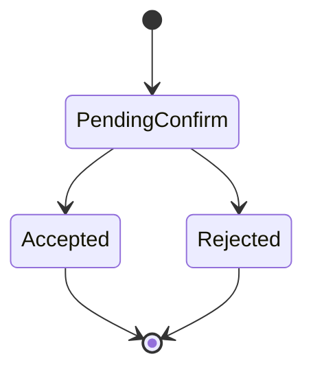
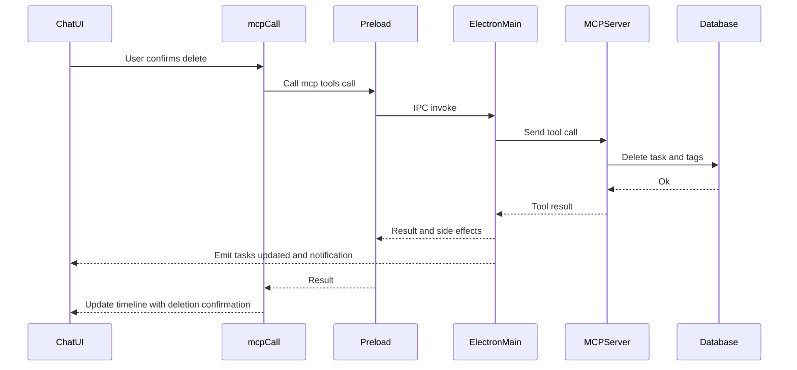
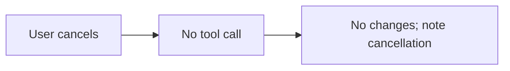

# tasky_delete_task

## Description
Permanently deletes a Tasky task by ID, removing all associated data including tags and references.

## Purpose
Remove tasks from the system when they are no longer needed. This is a destructive operation that cannot be undone and requires explicit user confirmation.

## Parameters

| Parameter | Type | Required | Description |
|-----------|------|----------|-------------|
| `id` | string | ✅ | Task ID to delete |

## UI Flow

1. **User Input:** "Delete task ABC123" or "Remove the login bug task"
2. **AI Processing:** Identifies task ID to delete
3. **Tool Call:** `mcpCall` invoked with task ID
4. **⚠️ Confirmation Required:** User sees destructive action warning
5. **Confirmation Dialog:** Shows:
   - Task details to be deleted
   - Warning about permanent removal
   - Cascading deletions (tags, references)
6. **Execution:** Upon user approval, task permanently removed
7. **Result Display:** Confirmation message with deletion summary

## Database Operations

## Confirmation Outcomes

This tool requires user confirmation. Auto accept is not used for delete.

State



Accepted



Rejected



Auto accept

- Not applicable for delete

Side effects on accept
- Emits `tasky:tasks-updated` event
- OS notification for deleted task
- Adaptive card snapshot embedded in chat

See also: [State Management Diagrams](../state-management-diagrams.md)

## Adaptive Card Response

Snapshot shape

```json
{
  "__taskyCard": {
    "kind": "result",
    "tool": "tasky_delete_task",
    "status": "success",
    "data": {
      "id": "fix_login_bug_20250907_143022_abc123",
      "title": "Fix login bug",
      "tags": ["bug","authentication"],
      "status": "PENDING"
    },
    "meta": {
      "operation": "delete",
      "timestamp": "2025-09-17T16:00:00.000Z"
    }
  }
}
```

Error variant

```json
{
  "__taskyCard": {
    "kind": "result",
    "tool": "tasky_delete_task",
    "status": "error",
    "error": { "message": "Task not found", "code": "NOT_FOUND" }
  }
}
```

Renderer notes
- Success: Deletion confirmation with task summary.
- Error: Inline error card with retry guidance.
- Unknown shape: Fallback to raw JSON rendering.

```sql
-- Transaction ensures referential integrity
BEGIN TRANSACTION;

-- Delete associated tags first (foreign key constraint)
DELETE FROM task_tags WHERE task_id = ?;

-- Delete the main task record
DELETE FROM tasks WHERE id = ?;

COMMIT;
```

## UI Components

- **ConfirmOverlay:** Enhanced confirmation dialog with:
  - ⚠️ Destructive action warning
  - Task details preview
  - "This action cannot be undone" message
  - Explicit "Delete Task" / "Cancel" buttons
- **ToolCallDisplay:** Shows deletion operation status
- **AdaptiveCardRenderer:** Displays confirmation result
- **MessageContainer:** Integrates deletion result in chat

## MCP Request Example

```bash
curl -X POST http://localhost:7844/mcp \
  -H "Content-Type: application/json" \
  -d '{
    "jsonrpc": "2.0",
    "id": 4,
    "method": "tools/call",
    "params": {
      "name": "tasky_delete_task",
      "arguments": {
        "id": "fix_login_bug_20250907_143022_abc123"
      }
    }
  }'
```

## Response Format

```json
{
  "jsonrpc": "2.0",
  "id": 4,
  "result": {
    "content": [
      {
        "type": "text",
        "text": "{\"success\": true}"
      }
    ]
  }
}
```

## Confirmation Flow

### Step 1: Tool Request
```
User: "Delete task ABC123"
AI: Calls tasky_delete_task
```

### Step 2: Confirmation Dialog
```
⚠️ Delete Task

Task: fix_login_bug_20250907_143022_abc123
Title: Fix login bug
Status: PENDING
Tags: bug, authentication

This action cannot be undone.
All associated data will be permanently removed.

[Delete Task] [Cancel]
```

### Step 3: Result Display
```
✅ Task Deleted

Successfully deleted task:
fix_login_bug_20250907_143022_abc123

• Removed main task record
• Deleted 2 associated tags
• Cleared any references
```

## Cascading Deletions

| Component | Action |
|-----------|---------|
| Task Record | Permanently removed from `tasks` table |
| Task Tags | All tags deleted from `task_tags` table |
| Dependencies | References removed from other tasks |
| Reminders | Associated reminders remain (separate entities) |
| Chat History | Tool results preserved in conversation |

## Error Handling

| Error | Cause | Response |
|-------|--------|----------|
| Missing ID | `id` parameter not provided | `{"content": [{"type": "text", "text": "id is required"}], "isError": true}` |
| Task not found | ID doesn't exist | Silent success (idempotent) |
| Database error | SQLite operation failure | Transaction rollback with error details |
| Foreign key violation | Constraint issues | Error message with relationship details |

## Security Considerations

- **Confirmation Required:** Always requires explicit user approval
- **No Bulk Delete:** Single task deletion only
- **Audit Trail:** Deletion logged in chat history
- **Transaction Safety:** Atomic operation prevents partial deletions
- **User Intent:** AI must clearly identify task to delete

## Transaction Details

```sql
-- Atomic deletion transaction
BEGIN IMMEDIATE TRANSACTION;

-- Check if task exists (optional validation)
SELECT COUNT(*) FROM tasks WHERE id = ?;

-- Delete tags first to satisfy foreign key constraints
DELETE FROM task_tags WHERE task_id = ?;

-- Delete main task record
DELETE FROM tasks WHERE id = ?;

-- Commit all changes atomically
COMMIT;
```

## Common Usage Patterns

### Direct ID Deletion
- "Delete task ABC123"
- "Remove task with ID XYZ789"

### Natural Language Deletion
- "Delete the login bug task" (AI must resolve to ID)
- "Remove my urgent authentication task"

### Bulk-like Requests
- "Delete all completed tasks" → Requires individual confirmations
- "Clean up old tasks" → User must specify criteria

## Recovery Options

⚠️ **Important:** Task deletion is permanent. No built-in recovery options exist.

**Prevention Measures:**
- Always show task details in confirmation
- Require explicit user approval
- Consider task archiving instead of deletion
- Backup database before bulk operations

## Performance Impact

- **Fast Operation:** Single transaction with minimal queries
- **Index Usage:** Benefits from primary key lookup
- **Minimal I/O:** Only affected records modified
- **Lock Duration:** Brief exclusive lock during transaction

## Related Operations

### Alternative to Deletion
- **Archive Task:** `tasky_update_task` with `status: "archived"`
- **Cancel Task:** `tasky_update_task` with `status: "cancelled"`

### Cleanup Operations
- **List Completed:** Use before deletion to review candidates
- **Bulk Operations:** Multiple individual delete calls required

## Implementation Details

- **Tool Handler:** `tasky-mcp-agent/src/mcp-server.ts:148-170`
- **Database Logic:** `tasky-mcp-agent/src/utils/task-bridge.ts:240-249`
- **UI Confirmation:** `src/components/chat/ConfirmOverlay.tsx`
- **Result Display:** `src/components/chat/AdaptiveCardRenderer.tsx`

## Best Practices

1. **Confirm Before Delete:** Always show task details
2. **Consider Alternatives:** Archive vs. delete
3. **Document Reason:** Add deletion context to chat
4. **Backup Critical:** Backup before bulk deletions
5. **User Education:** Explain permanent nature

## Related Components

- `tasky-mcp-agent/src/mcp-server.ts:148-170` - Tool definition and handler
- `tasky-mcp-agent/src/utils/task-bridge.ts:240-249` - Database deletion logic
- `src/components/chat/ConfirmOverlay.tsx` - Destructive action confirmation
- `src/ai/mcp-tools.ts:102-111` - Confirmation logic for destructive operations