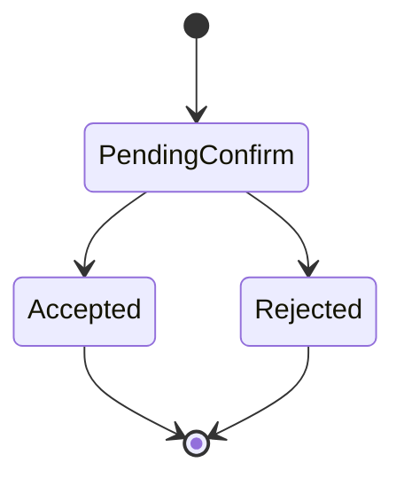
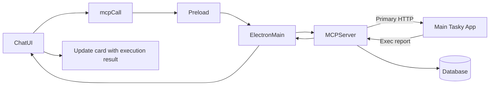
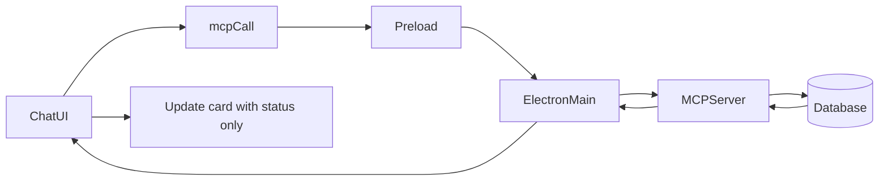
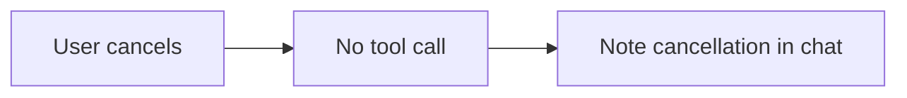

# tasky_execute_task

## Description
Executes a selected task by updating status to IN_PROGRESS or COMPLETED, with optional integration to the main Tasky application for actual task execution.

## Purpose
Start task execution or mark tasks as complete. Attempts to delegate to the main Tasky app for automated execution, with fallback to simple status updates if the main app is unavailable.

## Parameters

| Parameter | Type | Required | Description |
|-----------|------|----------|-------------|
| `id` | string | ❌ | Task ID to execute (preferred when available) |
| `matchTitle` | string | ❌ | Exact or approximate title used to resolve the task when `id` isn’t provided |
| `title` | string | ❌ | Alias for `matchTitle`; natural phrases like "execute login bug" are accepted |
| `status` | "IN_PROGRESS" \| "COMPLETED" | ❌ | Target status (defaults to "IN_PROGRESS") |

## UI Flow

1. **User Input:** "Start working on task ABC123" or "Execute the login bug fix"
2. **AI Processing:** Prefers existing task ID; otherwise resolves by fuzzy title
3. **Tool Call:** `mcpCall` invoked with id or matchTitle/title and optional status
4. **Confirmation:** User sees execution confirmation dialog
5. **Dual Execution Path:**
   - **Primary:** HTTP call to main Tasky app at localhost:7844/execute-task
   - **Fallback:** Simple status update in database
6. **Result Display:** Execution status and any automated results
7. **Status Update:** Task status updated based on execution outcome

## Execution Architecture

## Confirmation Outcomes

This tool requires user confirmation. Auto accept is not used for execution.

State



Accepted



Fallback on accept



Rejected



Auto accept

- Not applicable for execute

Side effects on accept
- Emits `tasky:tasks-updated` event
- OS notification for task status change
- Adaptive card snapshot embedded in chat

See also: [State Management Diagrams](../state-management-diagrams.md)

## Adaptive Card Response

Snapshot shape success primary

```json
{
  "__taskyCard": {
    "kind": "result",
    "tool": "tasky_execute_task",
    "status": "success",
    "data": {
      "id": "fix_login_bug_20250907_143022_abc123",
      "title": "Fix login bug",
      "previousStatus": "PENDING",
      "newStatus": "IN_PROGRESS",
      "delegated": true,
      "provider": "claude"
    },
    "meta": { "operation": "execute", "timestamp": "2025-09-17T16:00:00.000Z" }
  }
}
```

Snapshot shape success fallback

```json
{
  "__taskyCard": {
    "kind": "result",
    "tool": "tasky_execute_task",
    "status": "success",
    "data": {
      "id": "fix_login_bug_20250907_143022_abc123",
      "title": "Fix login bug",
      "previousStatus": "PENDING",
      "newStatus": "IN_PROGRESS",
      "delegated": false
    },
    "meta": { "operation": "execute", "timestamp": "2025-09-17T16:00:00.000Z" }
  }
}
```

Error variant

```json
{
  "__taskyCard": {
    "kind": "result",
    "tool": "tasky_execute_task",
    "status": "error",
    "error": { "message": "Connection refused", "code": "CONNECTION" }
  }
}
```

Renderer notes
- Primary: Show execution details and results.
- Fallback: Show status change note and warn about limited automation.
- Error: Show inline error with suggestion to start main app.

### Primary Path: Main App Integration
```
MCP Tool → HTTP POST → Main Tasky App → Agent Execution → Database Update
```

### Fallback Path: Status Update
```
MCP Tool → Direct Database Update → Status Change
```

## Database Operations

### Primary Execution (via HTTP)
```typescript
// HTTP request to main Tasky application
const postData = JSON.stringify({
  taskId: id,
  options: { agent: 'claude' }
});

const response = await fetch('http://localhost:7844/execute-task', {
  method: 'POST',
  headers: { 'Content-Type': 'application/json' },
  body: postData
});
```

### Fallback Database Update
```sql
-- Simple status update if main app unavailable
UPDATE tasks SET 
  status = @status,
  updated_at = @updated_at,
  completed_at = @completed_at  -- Only if status = 'COMPLETED'
WHERE id = @id;
```

## MCP Request Example

```bash
curl -X POST http://localhost:7844/mcp \
  -H "Content-Type: application/json" \
  -d '{
    "jsonrpc": "2.0",
    "id": 5,
    "method": "tools/call",
    "params": {
      "name": "tasky_execute_task",
      "arguments": {
        "id": "fix_login_bug_20250907_143022_abc123",
        "status": "IN_PROGRESS"
      }
    }
  }'
```

## Response Formats

### Successful Main App Execution
```json
{
  "jsonrpc": "2.0",
  "id": 5,
  "result": {
    "content": [
      {
        "type": "text",
        "text": "{\"__taskyCard\":{\"kind\":\"result\",\"tool\":\"tasky_execute_task\",\"status\":\"success\",\"data\":{\"id\":\"...\",\"title\":\"...\",\"previousStatus\":\"PENDING\",\"newStatus\":\"IN_PROGRESS\",\"delegated\":true,\"provider\":\"claude\"},\"meta\":{\"operation\":\"execute\",\"timestamp\":\"...\"}}}"
      }
    ]
  }
}
```

### Fallback Status Update
```json
{
  "jsonrpc": "2.0",
  "id": 5,
  "result": {
    "content": [
      {
        "type": "text",
        "text": "{\"__taskyCard\":{\"kind\":\"result\",\"tool\":\"tasky_execute_task\",\"status\":\"success\",\"data\":{\"id\":\"...\",\"title\":\"...\",\"previousStatus\":\"PENDING\",\"newStatus\":\"IN_PROGRESS\",\"delegated\":false},\"meta\":{\"operation\":\"execute\",\"timestamp\":\"...\"}}}"
      }
    ]
  }
}
```

## UI Components

- **ConfirmOverlay:** Shows execution confirmation with:
  - Task details
  - Execution method (main app vs. status update)
  - Expected outcomes
- **ToolCallDisplay:** Renders execution progress and results
- **AdaptiveCardRenderer:** Displays:
  - Execution status
  - Automated results (if main app executed)
  - Status change confirmation
  - Error messages for fallbacks

## Execution Scenarios

### Scenario 1: Main App Available
1. **HTTP Success:** Task delegated to main Tasky application
2. **Agent Execution:** Automated task processing (file edits, tests, etc.)
3. **Results Return:** Detailed execution report with changes
4. **Status Update:** Automatic status progression based on results

### Scenario 2: Main App Unavailable  
1. **HTTP Failure:** Connection refused or timeout
2. **Fallback Mode:** Simple database status update
3. **User Notification:** Warning about limited functionality
4. **Manual Completion:** User must handle actual task work

### Scenario 3: Completion Request
1. **Status Override:** User specifies "COMPLETED" status
2. **Execution First:** Attempts main app execution if available
3. **Completion Update:** Forces status to COMPLETED after execution
4. **Timestamp:** Sets completedAt timestamp

## Error Handling

| Error Type | Cause | Response |
|------------|--------|----------|
| Missing ID | `id` parameter not provided | `{"content": [{"type": "text", "text": "id is required"}], "isError": true}` |
| Task not found | Invalid task ID | Task not found error from update operation |
| Connection refused | Main Tasky app not running | Fallback to status update with warning |
| HTTP timeout | Main app unresponsive | 8-second timeout, fallback to status update |
| Invalid status | Unknown status value | Database constraint error |

## Timeout Configuration

- **HTTP Timeout:** 8 seconds to keep logs concise
- **Connection Timeout:** Standard TCP timeout
- **Graceful Degradation:** Always falls back to status update

## Integration Details

### Main App HTTP Endpoint
- **URL:** `http://localhost:7844/execute-task`
- **Method:** POST
- **Content-Type:** `application/json`
- **Body:** `{"taskId": "...", "options": {"agent": "claude"}}`

### Expected Main App Response
```json
{
  "performed": "automated_execution",
  "agent": "claude", 
  "results": "Description of automated changes",
  "duration": 240,
  "filesModified": ["src/auth.js", "tests/auth.test.js"],
  "status": "completed"
}
```

## Performance Considerations

- **HTTP First:** Always attempts main app integration
- **Quick Fallback:** 8-second timeout prevents long waits
- **Atomic Updates:** Database changes are transactional
- **Status Consistency:** Ensures task status remains coherent

## Common Usage Patterns

### Start Task Work
- **Input:** "Start task ABC123"
- **Result:** Status → IN_PROGRESS, possible automated execution

### Complete Task
- **Input:** "Complete task ABC123" 
- **Result:** Status → COMPLETED, completedAt timestamp

### Execute with Automation
- **Input:** "Execute the bug fix task"
- **Result:** Automated fixes applied if main app available

## Status Transition Logic

| Current Status | Execute Action | Result Status | Notes |
|----------------|----------------|---------------|--------|
| PENDING | Execute | IN_PROGRESS | Default behavior |
| PENDING | Execute (COMPLETED) | COMPLETED | Direct completion |
| IN_PROGRESS | Execute | IN_PROGRESS | Re-execution attempt |
| IN_PROGRESS | Execute (COMPLETED) | COMPLETED | Mark as done |
| COMPLETED | Execute | COMPLETED | No change, may re-run |

## Related Components

- `tasky-mcp-agent/src/mcp-server.ts:172-195` - Tool definition and handler
- `tasky-mcp-agent/src/utils/task-bridge.ts:337-415` - Execution logic with HTTP bridge
- `src/components/chat/ConfirmOverlay.tsx` - Execution confirmation UI
- `src/components/chat/AdaptiveCardRenderer.tsx` - Results display

## Best Practices

1. **Check Main App:** Ensure main Tasky application is running for full features
2. **Appropriate Status:** Use IN_PROGRESS for starting, COMPLETED for finishing
3. **Review Results:** Check automated execution results before proceeding
4. **Fallback Awareness:** Understand when manual work is required
5. **Error Recovery:** Handle connection failures gracefully