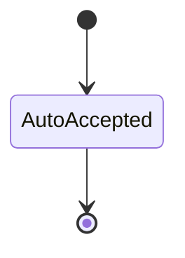
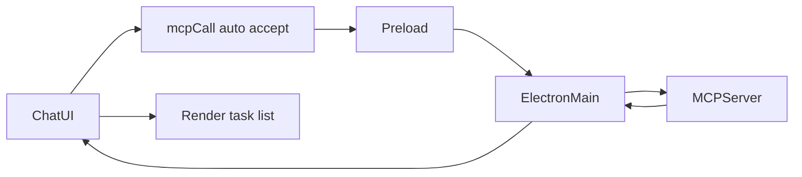

# tasky_list_tasks

## Description
Lists all Tasky tasks with optional filtering capabilities.

## Purpose
Query and display existing tasks with support for status filtering, tag filtering, search, and pagination. This is a read-only operation that provides comprehensive task visibility.

## Parameters

| Parameter | Type | Required | Description |
|-----------|------|----------|-------------|
| `status` | "pending" \| "in_progress" \| "completed" \| "cancelled" | ❌ | Filter by task status |
| `tag` | string | ❌ | Filter by specific tag |
| `limit` | number | ❌ | Maximum number of tasks to return |
| `search` | string | ❌ | Search in title and description (case-insensitive) |
| `dueDateFrom` | string | ❌ | Filter tasks due after this date (ISO format) |
| `dueDateTo` | string | ❌ | Filter tasks due before this date (ISO format) |
| `offset` | number | ❌ | Pagination offset (default: 0) |

## UI Flow

1. **User Input:** "Show me all pending tasks" or "List my tasks tagged with 'bug'"
2. **Auto-Execution:** No confirmation needed (read-only operation)
3. **AI Processing:** Parses filter requirements from natural language
4. **Tool Call:** `mcpCall` invoked with filter parameters
5. **Result Display:** Tasks shown as structured list in chat
6. **Adaptive Cards:** Each task rendered with details and metadata
7. **Pagination:** Large result sets automatically paginated

## Database Operations

## Confirmation Outcomes

This is a read only operation and is auto accepted.

State



Auto accept



Rejected

- Not applicable for read only tool

Accepted

- Same as auto accept for read only tool

Side effects
- Minimal UI side effects; no notifications
- Adaptive card snapshot embedded in chat

See also: [State Management Diagrams](../state-management-diagrams.md)

## Adaptive Card Response

Snapshot shape

```json
{
  "__taskyCard": {
    "kind": "result",
    "tool": "tasky_list_tasks",
    "status": "success",
    "data": [
      { "schema": { "id": "a1", "title": "Fix login bug", "tags": ["bug"], "dueDate": "2025-09-08T17:00:00.000Z" }, "status": "PENDING" },
      { "schema": { "id": "a2", "title": "Write tests", "tags": ["testing"] }, "status": "IN_PROGRESS" }
    ]
  }
}
```

Error variant

```json
{
  "__taskyCard": {
    "kind": "result",
    "tool": "tasky_list_tasks",
    "status": "error",
    "error": { "message": "Database error" }
  }
}
```

Renderer notes
- Success: Renders a list of task cards with status and tags.
- Error: Inline error card with retry option.

```sql
-- Main query to fetch all tasks
SELECT * FROM tasks;

-- Fetch all task tags for association
SELECT task_id, tag FROM task_tags;

-- Applied filters in application code:
-- - Status filtering
-- - Tag filtering  
-- - Search in title/description
-- - Due date range filtering
-- - Sorting by due date, then creation date
-- - Pagination with offset/limit
```

## Sorting Logic

1. **Primary:** Tasks with due dates first (ascending by due date)
2. **Secondary:** Tasks without due dates
3. **Tertiary:** By creation date (newest first)

## MCP Request Example

```bash
curl -X POST http://localhost:7844/mcp \
  -H "Content-Type: application/json" \
  -d '{
    "jsonrpc": "2.0",
    "id": 2,
    "method": "tools/call",
    "params": {
      "name": "tasky_list_tasks",
      "arguments": {
        "status": "pending",
        "tag": "bug",
        "limit": 5,
        "search": "login"
      }
    }
  }'
```

## Response Format

```json
{
  "jsonrpc": "2.0",
  "id": 2,
  "result": {
    "content": [
      {
        "type": "text",
        "text": "Returned 2 of 15 tasks"
      },
      {
        "type": "text",
        "text": "[{\"schema\":{\"id\":\"fix_login_bug_20250907_143022_abc123\",\"title\":\"Fix login bug\",\"description\":\"Users cannot log in with Google OAuth\",\"createdAt\":\"2025-09-07T14:30:22.000Z\",\"updatedAt\":\"2025-09-07T14:30:22.000Z\",\"dueDate\":\"2025-09-08T17:00:00.000Z\",\"tags\":[\"bug\",\"authentication\"],\"assignedAgent\":\"claude\"},\"status\":\"PENDING\",\"reminderEnabled\":false},{\"schema\":{\"id\":\"update_auth_flow_20250907_150000_def456\",\"title\":\"Update auth flow\",\"description\":\"Modernize authentication system\",\"createdAt\":\"2025-09-07T15:00:00.000Z\",\"updatedAt\":\"2025-09-07T15:00:00.000Z\",\"tags\":[\"enhancement\",\"authentication\"],\"assignedAgent\":\"claude\"},\"status\":\"PENDING\",\"reminderEnabled\":false}]"
      }
    ]
  }
}
```

## UI Components

- **MessageContainer:** Displays task list in chat timeline
- **AdaptiveCardRenderer:** Formats each task as a card with:
  - Task ID and title
  - Status badge
  - Due date (if set)
  - Tags as chips
  - Description preview
  - Assigned agent
  - Creation/update timestamps
- **ToolCallDisplay:** Shows tool execution status (minimal for read-only)

## Filter Examples

### Status Filtering
- "Show completed tasks"
- "List tasks in progress"
- "What pending tasks do I have?"

### Tag Filtering  
- "Show me bug tasks"
- "List all urgent items"
- "Tasks tagged with authentication"

### Search Filtering
- "Find tasks about login"
- "Search for database tasks"
- "Tasks containing 'API'"

### Date Filtering
- "Tasks due this week"
- "Overdue tasks"
- "Tasks due before Friday"

## Pagination Behavior

- **Default:** Returns all matching tasks
- **With Limit:** Returns first N tasks after sorting
- **With Offset:** Skips first N tasks for pagination
- **Metadata:** Response includes "Returned X of Y tasks"

## Performance Considerations

- **Tags:** Loaded in single query, joined in application
- **Sorting:** Applied after all filters for consistency
- **Memory:** Large datasets handled through pagination
- **Indexing:** Database indexes on status, created_at, due_date

## Error Handling

| Error | Cause | Response |
|-------|--------|----------|
| Database error | SQLite query failure | Error message with details |
| Invalid status | Unknown status value | Empty result set |
| Invalid date | Malformed date filter | Date parsing error |

## Implementation Details

- **Auto-Confirmation:** Read-only operation, no user confirmation required
- **Result Caching:** No caching - always fresh data
- **Transaction:** Single read transaction for consistency
- **Case Sensitivity:** Search is case-insensitive

## Common Use Cases

1. **Dashboard View:** `{}` (no filters) - shows all tasks
2. **Active Work:** `{"status": "in_progress"}` - current work
3. **Planning:** `{"status": "pending", "limit": 10}` - next tasks
4. **Bug Tracking:** `{"tag": "bug"}` - all bug-related tasks
5. **Urgent Items:** `{"search": "urgent"}` - priority tasks

## Related Components

- `tasky-mcp-agent/src/mcp-server.ts:79-107` - Tool definition and handler
- `tasky-mcp-agent/src/utils/task-bridge.ts:283-335` - Database query logic
- `src/components/chat/AdaptiveCardRenderer.tsx` - Task card display
- `src/components/chat/MessageContainer.tsx` - List integration in chat