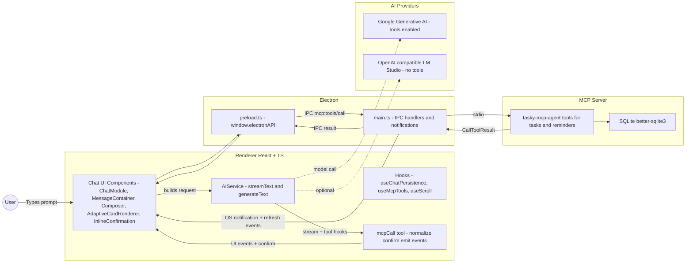
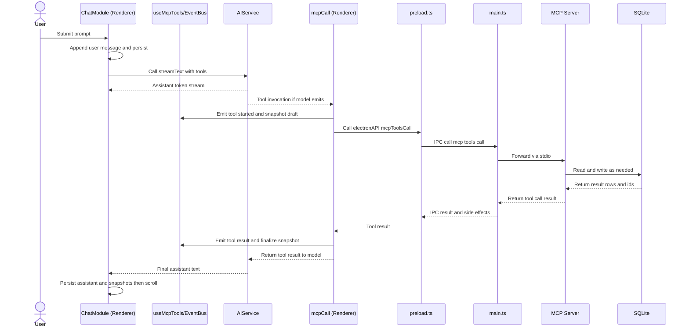
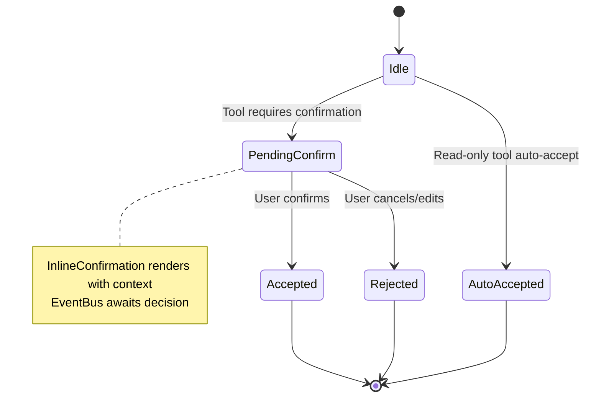
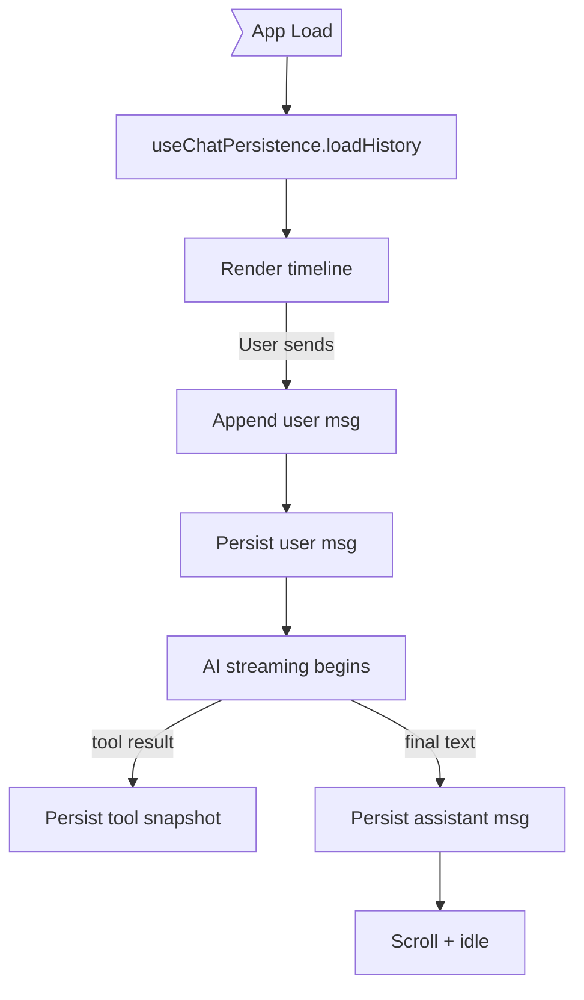
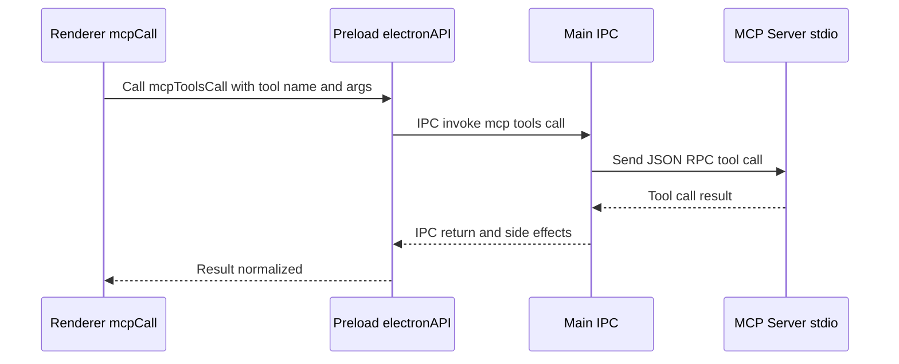
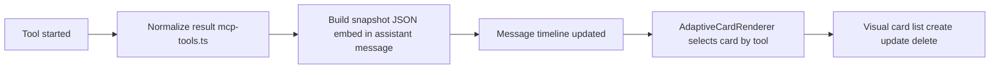
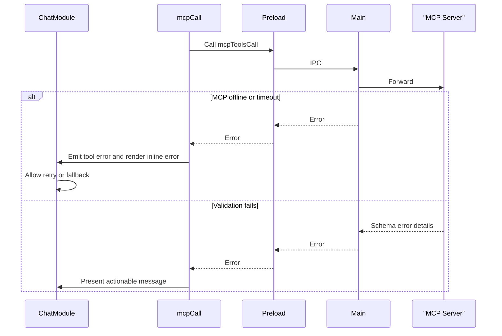

# Tasky Chat State Management Diagrams

This page provides end-to-end diagrams of how chat state flows through the Renderer (React), Electron (preload/main), AI provider, and the MCP server. Each diagram includes a brief note on where key state mutations occur.

## System Overview

Notes:
- State mutates primarily in `ChatModule` (messages/timeline), `useChatPersistence` (load/save), and `useMcpTools` (tool event bus, snapshots, confirmations).
- Side-effects: Electron `main.ts` emits notifications and UI refresh events after CRUD tools.

## Chat Send + Tool Sequence

Key state writes:
- Append/persist messages at send-time and when assistant/tool results arrive.
- Tool snapshots embedded in assistant messages for AdaptiveCardRenderer.

## Confirmation State Machine (Tools)

Where:
- Transition guards live in `mcp-tools.ts` (read-only auto-accept rules).
- UI for `PendingConfirm` is `InlineConfirmation` within the message context.

## Persistence Flow

Notes:
- Persistence API exposed via `preload.ts` and handled in `main.ts` (chat CRUD).
- Renderer holds the in-memory timeline; DB is source of truth across sessions.

## MCP Call Across Processes

Side-effects from `main.ts` after CRUD tools:
- Emits `tasky:tasks-updated` / `tasky:reminders-updated` events to the renderer.
- Triggers OS notifications via `notification-utility.ts` for creates/updates/deletes.

## Adaptive Card Snapshot Pipeline

Extraction:
- Renderer pulls snapshots from assistant messages when rendering; falls back to raw JSON if unknown tool.

## Error and Retry Paths

Guidance:
- Keep tool args minimal and validated before invocation.
- Surface actionable errors in `MessageBubble` with retry affordances.

---

For component and file references, see the companion guide: [docs/chat-ui-cheatsheet.md](./chat-ui-cheatsheet.md).
